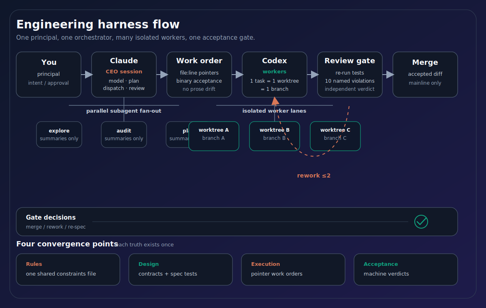
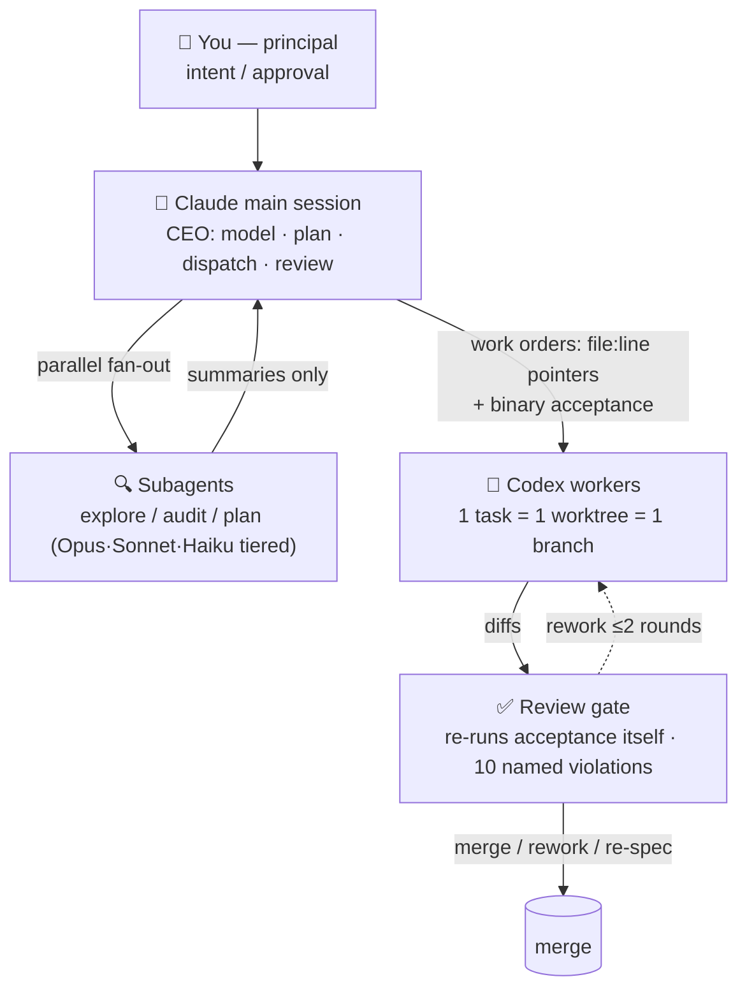

<div align="center">


# 🎼 Fugue

*In a fugue, many voices develop one theme under strict counterpoint.*
*Here, many agents build one spec under shared constraints.*

Claude Code as the CEO/orchestrator · OpenAI Codex CLI as the worker fleet · code-as-design use-case modeling — a complete anti-drift multi-agent engineering harness.

[](LICENSE)
[](https://claude.com/claude-code)
[](https://github.com/openai/codex)
[]()
[]()

**English** · [简体中文](README.zh-CN.md) · [日本語](#-日本語) · [Deutsch](#-deutsch)

</div>

---

> [!NOTE]
> **Origin.** When **Fable 5** shipped, I gave it the CEO seat and pointed it at a years-old quant trading codebase. Fable modeled and dispatched, Codex workers wrote every line, spec tests were the only design documents — the full rebuild runs on exactly this harness. Even this repo's SVG art was produced by a Codex worker dispatched through the pipeline it illustrates.

## Why

Most people drive one AI agent at a time, by hand, and watch the work **drift**: design docs fall out of sync with code, each session re-explains everything, workers quietly weaken tests to "pass". This repo is a working counter-design:

- 🧠 **Claude (main session) never writes implementation code.** It models, plans, dispatches, and reviews — a CEO with parallel subagent teams.
- 🔧 **Codex CLI workers do the coding.** Yes — *Claude can drive Codex*: headless `codex exec`, one task = one git worktree = one resumable thread, reviewed before merge. The dispatch wrapper is included.
- 📐 **Design documents are executable.** A feature is modeled as a typed use-case contract + Given/When/Then spec tests. The work order degenerates to *"make these tests pass"* — pointers, not prose. Prose drifts; specs don't.

<div align="center">

</div>

<details>
<summary>Text version (mermaid)</summary>



</details>

## What's inside

| Path | What it is |
|---|---|
| [`CLAUDE.md`](CLAUDE.md) | The user-level operating system: org model (CEO + tiered subagent teams), routing rules, the 4-item subagent prompt template, context-budget discipline (compact / rewind / blackboard state files). Drop into `~/.claude/CLAUDE.md`. |
| [`skills/codex-team/`](skills/codex-team/) | **Claude dispatches Codex.** Headless `codex exec` wrapper ([`codex-task.sh`](skills/codex-team/scripts/codex-task.sh)): worktree-per-task, resumable threads, standing orders auto-appended, review/rework/merge loop. |
| [`skills/codex-prompt-craft/`](skills/codex-prompt-craft/) | The work-order format: minimal-context, hard invariants up top, binary acceptance gates, 10-point self-check. *"A work order, not an audit trail."* |
| [`skills/write-use-case/`](skills/write-use-case/) | **Code-as-design.** Model a business action as a typed contract (`Command → GivenState → Output → events`) + spec tests, freeze the spec, then auto-codegen via Codex. Ships a dependency-free Python `CommandUseCase` protocol ([`use_case_contract.py`](skills/write-use-case/references/use_case_contract.py)). |
| [`skills/review-use-case/`](skills/review-use-case/) | The acceptance gate: named violations (`SPEC_TAMPERED` auto-reject, `CORE_IMPURE`, `EVENT_DRIFT`, …) and a three-way verdict: merge / rework / re-spec. |
| [`skills/clean-architecture/`](skills/clean-architecture/) | Architecture Q&A grounded in the live repo: `core (use_case + entity) / adapter (inbound + outbound) / infra`, strict dependency rules, minimal-restructuring output contract. |
| [`skills/shared/`](skills/shared/use_case_entity_constraints.md) | The single rulebook every skill references. Change a rule once; every skill follows. |

## The anti-drift design

Four convergence points, each existing **exactly once**:

| # | Converges to | Mechanism |
|---|---|---|
| 1 | **Rules** → one shared constraints file | skills reference it, never copy it |
| 2 | **Design** → executable artifacts | use-case contract + spec tests *are* the design doc; no parallel markdown to rot |
| 3 | **Execution** → pointer work-orders | `file:line` + "make these tests pass" + a do-not list; restating rules creates copy-drift, pointers can't |
| 4 | **Acceptance** → machine verdicts | reviewer re-runs the tests itself (a worker's green report counts for nothing) + 10 named violations |

And the bricks compose 🧱: use cases may never call each other, state arrives pre-loaded, side effects live behind ports — so **N use cases can be built by N parallel Codex workers with zero decision collisions**.

## A feature's lifecycle

1. **Model** (Claude, `write-use-case`) — one business action → one file declaring `Error → Cmd → GivenState → Output → events → UseCase`, plus Given/When/Then tests covering happy paths, every rejection, and the cmd × state matrix.
2. **Freeze** — commit the contract + failing tests. The spec is now immutable input.
3. **Codegen** (Codex, via `codex-team`) — the work order carries pointers + the acceptance command. The worker may not touch spec tests.
4. **Review** (Claude, `review-use-case`) — full diff read, independent test run, violation table, verdict.
5. **Change** — any behavior change starts by changing a spec test in a reviewed commit, then the loop repeats.

## Install

```bash
git clone https://github.com/qiuzhiaho1149-prog/fugue
cp fugue/CLAUDE.md ~/.claude/CLAUDE.md          # or merge into yours
cp -R fugue/skills/* ~/.claude/skills/
```

**Requirements**
- [Claude Code](https://claude.com/claude-code) — the orchestrator
- [Codex CLI](https://github.com/openai/codex) — the worker fleet; `codex-team` expects the app-bundled binary by default (`CODEX_BIN` overridable, see [`skills/codex-team/`](skills/codex-team/))

Skills auto-register from `~/.claude/skills/`. Say "dispatch to codex", "write a use case", or ask an architecture question — the matching skill triggers.

---

## 🇨🇳 中文

👉 **完整中文特化版：[README.zh-CN.md](README.zh-CN.md)** —— 含中文社区常见痛点对照、FAQ（为何要 Claude 派单 Codex / 与 TDD 的区别 / 非 Python 项目怎么办）与代理环境配置提示。

## 🇯🇵 日本語

<details>
<summary><b>日本語の概要を開く</b></summary>

AI 駆動ソフトウェア工学のための完全なマルチエージェント・ハーネス（手綱）：

- **Claude（メインセッション）が CEO**：モデリング・計画・発注・検収のみを担当し、実装コードは一切書かない。並列サブエージェント（Opus/Sonnet/Haiku の階層ルーティング）が調査・監査を行い、メインは要約だけを受け取る。
- **Codex CLI がワーカー**：Claude がヘッドレス `codex exec` を直接駆動（Claude から Codex を呼べることは意外と知られていない）。1 タスク = 1 worktree = 1 ブランチ、再開可能・差し戻し可能、検収ゲートを通過した場合のみマージ。
- **コードこそが設計**：ビジネスモデリング = 型付き契約 + Given/When/Then スペックテスト。テストが設計書そのものであり、Codex への作業指示は「このテストを通せ」というポインタに退化する。中間ドキュメントはドリフトの温床——だからゼロにする。
- **アンチ・ドリフト 4 収束点**:ルールは単一の制約ファイルへ、設計は実行可能な成果物へ、実行はポインタ作業指示へ、検収は機械判定へ（レビュアー自身がテストを再実行 + 10 種の命名済み違反チェック）。

ユースケース同士は呼び出し禁止・状態は注入・副作用はポート経由——N 個のユースケースを N 体の Codex ワーカーが衝突ゼロで並列実装できる。

</details>

## 🇩🇪 Deutsch

<details>
<summary><b>Deutsche Zusammenfassung öffnen</b></summary>

Ein vollständiges Multi-Agent-Harness („Zügel") für KI-getriebene Softwareentwicklung:

- **Claude (Hauptsession) als CEO**: modelliert, plant, delegiert und prüft ab — schreibt aber niemals selbst Implementierungscode. Parallele Subagenten-Teams (Opus/Sonnet/Haiku, gestaffeltes Routing) übernehmen Recherche und Audits; die Hauptsession liest nur Zusammenfassungen.
- **Codex CLI als Arbeiter-Flotte**: Claude steuert headless `codex exec` direkt an (dass Claude Codex aufrufen kann, wissen die wenigsten) — ein Task = ein Git-Worktree = ein wiederaufnehmbarer Thread, Merge erst nach bestandenem Abnahme-Gate.
- **Code als Design**: Fachliche Modellierung = typisierter Vertrag + Given/When/Then-Spezifikationstests. Die Tests *sind* das Designdokument; der Arbeitsauftrag an Codex degeneriert zu „bring diese Tests zum Bestehen" — Zeiger statt Prosa. Prosa driftet, ausführbare Spezifikationen nicht.
- **Vier Anti-Drift-Konvergenzpunkte**: Regeln → eine gemeinsame Constraints-Datei; Design → ausführbare Artefakte; Ausführung → Zeiger-Arbeitsaufträge; Abnahme → maschinelle Urteile (der Reviewer führt die Tests selbst erneut aus + 10 benannte Verstoß-Checks, `SPEC_TAMPERED` führt zur sofortigen Ablehnung).

Use Cases dürfen einander nie aufrufen, Zustand wird injiziert, Seiteneffekte laufen über Ports — N Use Cases können von N parallelen Codex-Arbeitern ohne Entscheidungskollisionen gebaut werden.

</details>

---

<div align="center">

**If this harness saves you from agent drift, a ⭐ helps others find it.**

MIT © 2026

</div>
