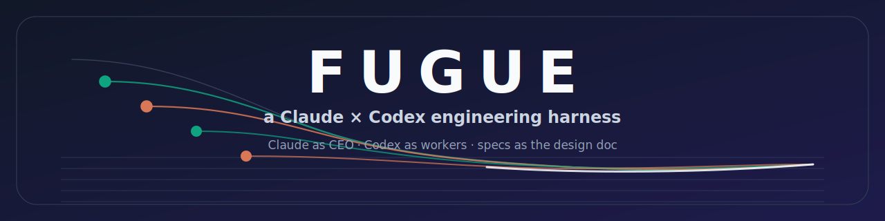
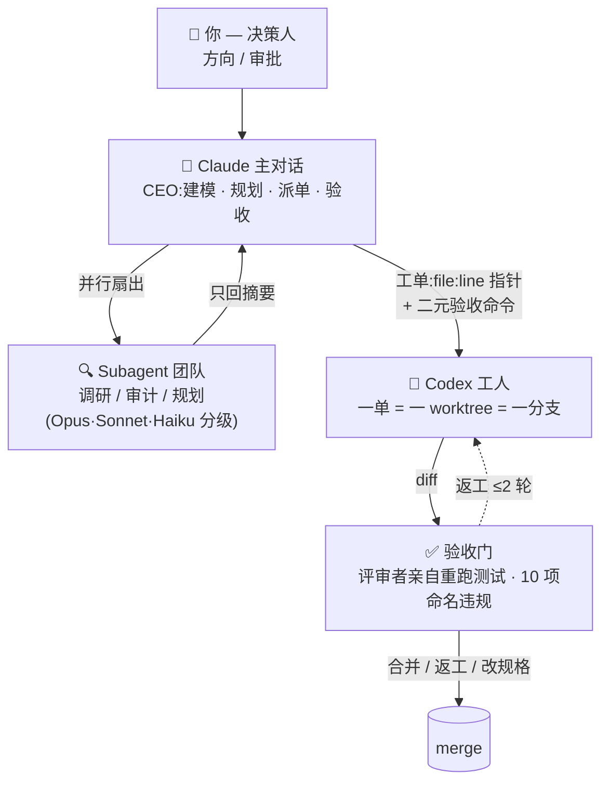

<div align="center">



# 🎼 Fugue（赋格）

*赋格：多个声部在同一主题、严格对位规则下并行展开。*
*这里：多个 agent 在同一规格、共享约束下并行施工。*

Claude Code 当 CEO 编排 · OpenAI Codex CLI 当工人出码 · 代码即设计 —— 一套完整的反漂移多智能体工程工作流

[](LICENSE)
[](https://claude.com/claude-code)
[](https://github.com/openai/codex)
[]()

[English](README.md) · **中文** · [日本語](README.md#-日本語) · [Deutsch](README.md#-deutsch)

</div>

---

> [!NOTE]
> **起源**：Fable 5 发布后，我把 CEO 席位交给它，对准了自己最不敢碰的东西——一座多年量化交易屎山。Fable 建模派单验收，Codex 工人写每一行实现，规格测试是唯一设计文档——整个重构就跑在本仓库这套缰绳上。连本仓库的 SVG 配图，都是流水线里的 Codex 工人画的。

## 你是不是也遇到了这些问题

用 AI 写代码一段时间后，几乎所有人都会撞上同一堵墙——**漂移**：

- 📄 设计文档写了一堆，三天后和代码对不上，没人敢信
- 🔁 每个新会话都要把项目背景重新喂一遍，token 烧到肉疼
- 🙈 AI 工人为了"测试通过"悄悄改弱断言、加 fallback 层、吞异常
- 🤹 一个对话窗口里又当架构师又当码农又当测试，上下文一长全乱

这个仓库是一套**跑通了的**反制设计。两个核心认知，很多人还不知道：

1. **Claude 可以直接调用 Codex 当工人。** 不是复制粘贴 prompt——是 Claude 主对话 headless 派单给 `codex exec`，一单一 worktree 一分支，可恢复、可返工、验收后合并。派单脚本就在本仓库里。
2. **设计文档应该是可执行的。** 业务建模 = 写类型契约 + Given/When/Then 规格测试。测试就是设计文档本体，给 Codex 的工单退化成一句"把这些测试做绿"。**散文会漂移，可执行规格不会。**

## 省 token 才是这套东西的本体

**最便宜的 token 是你从来不花的那个。** 这里每条机制同时都是省钱机制：

| 机制 | 不再为什么付费 |
|---|---|
| 🧾 **规格代替文档** | 一份产物（契约+测试）顶掉设计文档+需求文档+工单正文三样——写一次，永远不用向新会话重新解释 |
| 📌 **指针工单** | 文件系统、git 状态、测试命令 Codex 自己会查——工单只带 `file:line` + 验收命令，不为复制粘贴的上下文付两遍钱 |
| 🪜 **模型分级路由** | 非判断类活显式派 Sonnet/Haiku；不路由的多 agent 全继承大模型（Anthropic 实测 ~15× token 烧） |
| 🧹 **文档检疫** | 主会话永不直接吞 >100 行的文档——subagent 消化后回指针；大范围 grep / 长日志同样隔离 |
| 🗂️ **切片状态文件** | 编排者只读 1 页 INDEX，不读整本状态大全 |
| 🔁 **实现外包** | 编译-报错-重试的长循环烧在 Codex 的上下文里，不烧你的编排窗口——贵的窗口只装决策 |
| 🧱 **积木隔离** | 用例互不调用 → 工人对系统其余部分需要零上下文 |

贵的上下文窗口只留给一件事：**判断**。

## 整体架构



**角色分工像一家公司**：

| 角色 | 干什么 | 不干什么 |
|---|---|---|
| 你（决策人） | 定方向、批规格、定上线 | 不碰实现细节 |
| Claude（CEO） | 建模、派单、验收裁决 | **不写实现代码**、不亲自 grep |
| Codex（工人） | 把规格测试做绿 | 不许改测试、不许定架构 |

## 仓库里有什么

| 路径 | 说明 |
|---|---|
| [`CLAUDE.md`](CLAUDE.md) | 操作系统层：CEO 组织模型、subagent 分级路由（Opus 干高判断、Sonnet 干执行、Haiku 干轻活——不显式指定 model 会烧约 15 倍 token）、subagent prompt 四要素模板、context 预算纪律（compact / rewind / 黑板状态文件） |
| [`skills/codex-team/`](skills/codex-team/) | **Claude 派单 Codex** 的完整通道：`codex-task.sh` wrapper、worktree 隔离、线程可恢复、standing orders 自动附加、评审-返工-合并闭环 |
| [`skills/codex-prompt-craft/`](skills/codex-prompt-craft/) | 工单格式学：极简上下文、硬约束置顶、二元验收门、10 点自检。一句话心法：**"是工单，不是审计报告"** |
| [`skills/write-use-case/`](skills/write-use-case/) | **代码即设计**：业务动作建模为类型契约（`Command → GivenState → Output → events`）+ 规格测试，冻结后派 Codex 自动出码。附零依赖 Python `CommandUseCase` 协议 |
| [`skills/review-use-case/`](skills/review-use-case/) | 验收门：10 项命名违规（动规格测试 = `SPEC_TAMPERED` 一票否决）+ 三态裁决：合并 / 返工 / 改规格 |
| [`skills/clean-architecture/`](skills/clean-architecture/) | 架构问答，以活仓库为准：`core(use_case+entity) / adapter(inbound+outbound) / infra`、依赖方向铁律、最小重组输出契约 |
| [`skills/shared/`](skills/shared/use_case_entity_constraints.md) | 唯一规则源——所有 skill 引用它而非复制它，改规则只改这一处 |

## 反漂移的设计原理：四个收敛点

漂移的本质是**同一信息存在多份且互相走样**。所以这套设计让四类信息各自只剩一份：

| # | 收敛对象 | 机制 |
|---|---|---|
| 1 | **规则** → 一个共享约束文件 | skill 引用，永不复制 |
| 2 | **设计** → 可执行产物 | 契约 + 规格测试就是设计文档，没有第二份 markdown 可烂 |
| 3 | **执行** → 指针工单 | `file:line` + "做绿测试" + 禁止清单；复述规则才产生抄写漂移，指针不会 |
| 4 | **验收** → 机器判定 | 评审者亲自重跑测试（工人的"全绿报告"不作数）+ 10 项命名违规 |

外加**积木化** 🧱：用例互不调用、状态预加载注入、副作用全走 port——N 个用例可以派 N 个 Codex 工人**并行施工，零决策碰撞**。

## 一个功能的完整生命周期

1. **建模**（Claude，`write-use-case`）：一个业务动作 = 一个文件，按固定顺序声明 `Error → Cmd → GivenState → Output → events → UseCase`，规格测试覆盖正路、每条拒绝路径、cmd × state 矩阵
2. **冻结**：契约 + 红着的测试先 commit——从这一刻起规格是不可变输入
3. **出码**（Codex，经 `codex-team`）：工单只有指针 + 验收命令，工人不许碰规格测试
4. **验收**（Claude，`review-use-case`）：全量读 diff、独立重跑测试、违规表、裁决
5. **变更**：任何行为改动从改规格测试开始（独立 reviewed commit），然后循环重来——**规格不动，实现不许动**

## 安装

```bash
git clone https://github.com/qiuzhiaho1149-prog/fugue
cp fugue/CLAUDE.md ~/.claude/CLAUDE.md      # 或合并进你现有的
cp -R fugue/skills/* ~/.claude/skills/
```

**依赖**：
- [Claude Code](https://claude.com/claude-code)（总指挥）
- [Codex CLI](https://github.com/openai/codex)（工人舰队）——`codex-team` 默认走 app 内置二进制（`CODEX_BIN` 可覆盖，详见 skill 内说明）

skill 放进 `~/.claude/skills/` 即自动注册。对 Claude 说"派给 codex"、"写个用例"、或问任何架构问题，对应 skill 自动触发。

**给中文用户的提示**：
- skill 文档本体全英文是**有意的**——agent 跨模型工作时英文指令一致性和推理质量更好；你和 Claude 的对话照常用中文，`CLAUDE.md` 里的语言三明治规则（中文沟通 → 英文干活 → 中文汇报）会自动生效
- 如果你在代理环境下用 Codex / Claude Code，在 `~/.claude/settings.json` 的 `env` 里配 `HTTPS_PROXY` 即可，两边工具链都认

## 常见问题

**Q: 为什么不让 Claude 自己写代码，还要绕一道 Codex？**
主对话的 context 是最贵的资产。实现细节（几十轮编译报错、测试输出）会污染决策层上下文；派给 Codex 后主线只看 diff 和验收结果，一个会话能管的事多一个数量级。另外两个模型互相评审，比单模型自嗨可靠。

**Q: 规格测试先行，和 TDD 有什么区别？**
形式像，但目的不同：TDD 是开发节奏工具，这里规格测试是**跨 agent 的契约载体**——它替代了设计文档、需求文档和工单正文三样东西，是人、Claude、Codex 三方唯一共识源。

**Q: 我的项目不是 Python 怎么办？**
契约协议（`use_case_contract.py`）约 150 行零依赖，思路是从 Rust trait 移植来的——换语言重写一次协议即可，skill 流程本身语言无关。

---

<div align="center">

**如果这套缰绳帮你勒住了 AI 的漂移，点个 ⭐ 让更多人看到。**

MIT © 2026

</div>
